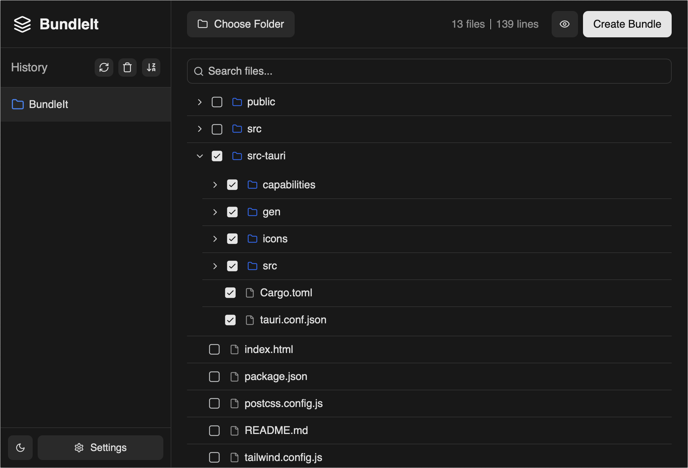

# BundleIt 📦

Simplify sharing large projects with AI tools like Claude, Deepseek or ChatGPT. Get more accurate, context-aware responses from AI—because better input means better output.

## Features ✨

-  🔒 100% offline processing - all data stays on your machine
-  📂 Easy file/folder selection with tree view
-  🔍 Live preview before bundling
-  ⚡ Fast file processing with smart caching
-  🔎 File search and filtering
-  🎯 Drag and drop support
-  💾 Recent folders history

<br>



## Installation 🚀

### Download

Download the latest version for your platform:

-  [macOS (.dmg)](https://github.com/safdar-azeem/bundleIt/releases/tag/v0.1.5)
-  [Windows (.exe)](https://github.com/safdar-azeem/bundleIt/releases/tag/v0.1.5)

### Build from Source

1. Prerequisites:

```bash
# Install Rust
curl --proto '=https' --tlsv1.2 -sSf https://sh.rustup.rs | sh

# Install Node.js (16+) and Yarn
npm install -g yarn
```

2. Clone & Install:

```bash
# Clone repository
git clone https://github.com/safdar-azeem/bundleit.git
cd bundleit

# Install dependencies
yarn install
```

3. Development:

```bash
# Run in development mode
yarn tauri dev

# Build for production
yarn tauri build
```

## Development Stack 🛠️

-  [Tauri 2.0](https://v2.tauri.app/) - Framework
-  [Vue 3](https://vuejs.org/) - Frontend
-  [Rust](https://www.rust-lang.org/) - Backend
-  [TypeScript](https://www.typescriptlang.org/) - Type Safety
-  [Tailwind CSS](https://tailwindcss.com/) - Styling

## Support 💬

If you encounter any issues or have questions:

-  [Open an issue](https://github.com/safdar-azeem/bundleit/issues)
-  [Check existing issues](https://github.com/safdar-azeem/bundleit/issues?q=is%3Aissue)

---

Made with ❤️ by [Safdar Azeem](https://github.com/safdar-azeem)
